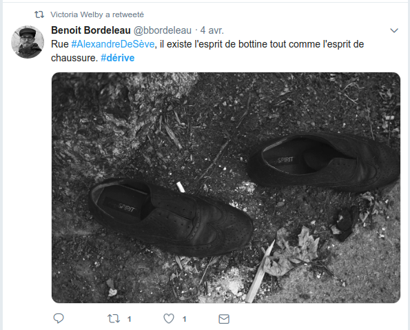

<!-- .slide: data-background-image="img/map.jpg" data-background-size="contain"-->
<!-- .slide: class="hover"-->

### Tracking, trailing, and pinning. Towards a geolocated semiotics.

#### Enrico Agostini-Marchese
ELO 2019
 
UCC - 17h July 2019

 <!-- .element: class="logo" style="width:30%; background-color:ghostwhite;padding: 5px" -->

<!-- .element: style="font-size:1.4rem" -->

 <!-- .element: class="logo" -->

§§§§§§§§§§§§§§§§§§§§§§§§§§§§§§§§§§§§§§§§§§§§§
<!-- .slide: data-background-image="img/chaire.png" data-background-size="contain"-->
%%%%%%%%%%%%%%%%%%%%%%%%%%%%%%%%%%%%%%%%%%%%%
<!-- .slide: data-background-image="img/location.jpg" -->
<!-- .slide: class="hover"-->

### Geo-location

- 2008, iPhone with GPS
- Location-based media and location-based social network
- Arts and geolocation : literature
§§§§§§§§§§§§§§§§§§§§§§§§§§§§§§§§§§§§§§§§§§§§§
<!-- .slide: data-background-image="img/tendre.jpg" -->
<!-- .slide: class="hover"-->

### Literature and space

- Homer, Ulysses and Ithaca
- "Today, if we want a representation of the "ideal" city and its relationship with the universe. [...] It's the science fiction writers who bring it. In science-fiction novels, all possible and impossible variants of the future urban reality have been considered"
- William Gibson's _Neuromancer_ : cyberspace

Henri Lefebvre, _The Right to the City_, Paris, Anthropos, 1967.

<!-- .element: class="source" -->
§§§§§§§§§§§§§§§§§§§§§§§§§§§§§§§§§§§§§§§§§§§§§
<!-- .slide: data-background-image="img/digicity.jpg" -->
<!-- .slide: class="hover"-->

### From cyber to hybrid space

- “the word “cyberspace” indicates a paradoxical constellation of, on the one hand, “spatiality,” which traditionally implies a physical and bodily sensation and, on the other, “information,” which moves the spatiality to an abstract, conceptual realm. This duality often results in an imprecise way of talking about cyberspace that attempts to mediate between the abstract and the concrete, but ends up in ephemeral, almost mythic, vocabulary about an “other” space.”
- Hybrid space, net locality, everyware, code/space, … : “we don't enter the web anymore; it is all around us"

Kristin Veel, "The Irreducibility of Space"

<!-- .element: class="source" -->
%%%%%%%%%%%%%%%%%%%%%%%%%%%%%%%%%%%%%%%%%%%%%
<!-- .slide: data-background-image="img/leo-3rd-gen.jpg" -->
<!-- .slide: class="hover"-->
### Three generations of e-lit

- Hyperlinks
- Media polyvalence
- Mobile devices

%%%%%%%%%%%%%%%%%%%%%%%%%%%%%%%%%%%%%%%%%%%%%
<!-- .slide: data-background-image="img/madeleine.jpg" -->
<!-- .slide: class="hover"-->
### Mobile devices and literature. Mobility and portability

- From connected screens (Bertrand Gervais) to freed screens
- Affordances of platforms (Twitter, Facebook, etc) and devices (short texts, photos, emojis, etc)
- Specific poetic and literary forms
  - Non digital-native
  - Digital-native
§§§§§§§§§§§§§§§§§§§§§§§§§§§§§§§§§§§§§§§§§§§§§

§§§§§§§§§§§§§§§§§§§§§§§§§§§§§§§§§§§§§§§§§§§§§
<object width="640" height="800" type="text/html" data="https://www.arnaudmaisetti.net/spip/spip.php?article1266">
</object>
§§§§§§§§§§§§§§§§§§§§§§§§§§§§§§§§§§§§§§§§§§§§§

§§§§§§§§§§§§§§§§§§§§§§§§§§§§§§§§§§§§§§§§§§§§§

§§§§§§§§§§§§§§§§§§§§§§§§§§§§§§§§§§§§§§§§§§§§§
<!-- .slide: data-background-image="img/disparition.png" -->
§§§§§§§§§§§§§§§§§§§§§§§§§§§§§§§§§§§§§§§§§§§§§
<!-- .slide: data-background-image="img/sp38.png" -->
%%%%%%%%%%%%%%%%%%%%%%%%%%%%%%%%%%%%%%%%%%%%%
<!-- .slide: data-background-image="img/pokemon.jpg" -->
<!-- .slide: class="hover"-->
### Mobile devices and literature. (Internet) connection

- Always connected : hyper-connected
- Internet and geolocation
  - Our relationship to space has changed
  - Location becomes a literary material
§§§§§§§§§§§§§§§§§§§§§§§§§§§§§§§§§§§§§§§§§§§§§

§§§§§§§§§§§§§§§§§§§§§§§§§§§§§§§§§§§§§§§§§§§§§

§§§§§§§§§§§§§§§§§§§§§§§§§§§§§§§§§§§§§§§§§§§§§

%%%%%%%%%%%%%%%%%%%%%%%%%%%%%%%%%%%%%%%%%%%%%
<!-- .slide: data-background-image="img/map.jpg" data-background-size="contain"-->
<!-- .slide: class="hover"-->
### Mobile devices and literature. Paratextual specificites

- Paratextual identity in digital literature
- Negociations in visual culture
  - Diverting mainstream
  - Integrating mainstream

  source image : Aram Bartholl, _Map_.

  <!-- .element: class="source" -->
§§§§§§§§§§§§§§§§§§§§§§§§§§§§§§§§§§§§§§§§§§§§§

§§§§§§§§§§§§§§§§§§§§§§§§§§§§§§§§§§§§§§§§§§§§§

§§§§§§§§§§§§§§§§§§§§§§§§§§§§§§§§§§§§§§§§§§§§§
<!-- .slide: data-background-image="img/oloe.png" data-background-size="contain"-->

source image : Anne Savelli, _Oloé_.

<!-- .element: class="source" -->
§§§§§§§§§§§§§§§§§§§§§§§§§§§§§§§§§§§§§§§§§§§§§
<!-- .slide: data-background-image="img/geolocaliserAmour.jpeg" data-background-size="contain"-->
